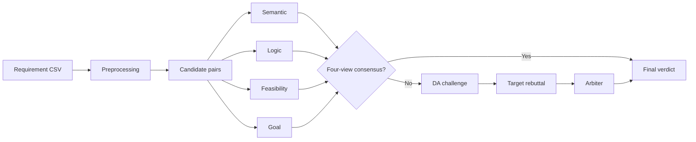

# Four-View Multi-Agent Requirement Conflict Detection

This repository contains a public research release of a multi-agent system for detecting conflicts between pairs of natural-language requirements.

A requirement conflict is an interference, inconsistency, or inability-to-coexist relationship between two requirements during requirements specification. Duplicate requirements are evaluated separately as redundancy and are not counted as conflict positives.

## Architecture

The system combines four independent Phase-1 evidence views:

- **Semantic:** textual meaning, modality, scope, actors, objects, and conditions.
- **Logic:** propositions, negation, quantification, numeric constraints, and consistency.
- **Feasibility:** implementation, resource, platform, operational, and engineering constraints.
- **Goal:** stakeholder intent, quality goals, and goal-level interference.

When all four views return the same `compatible` or `incompatible` verdict, the system finalizes that consensus without adjudication. Other vote patterns continue through DA challenge selection, target-agent rebuttal, and arbiter adjudication.



See [architecture.md](docs/architecture.md) and [detection-pipeline.md](docs/detection-pipeline.md) for the complete flow.

## Published Datasets

- ETCS-GOLD
- OpenAPI Specification 3.0
- promise-project2
- Broker-All
- Library-Gold

Dataset schemas, provenance limits, and licensing boundaries are documented in [DATASETS.md](datasets/DATASETS.md).

## Published Results

| Dataset | Precision | Recall | F1 | Accuracy |
| --- | ---: | ---: | ---: | ---: |
| ETCS-GOLD | 0.58 | 0.73 | 0.65 | 0.98 |
| OpenAPI Specification 3.0 | 0.91 | 1.00 | 0.95 | 1.00 |
| promise-project2 | 0.88 | 0.64 | 0.74 | 1.00 |
| Broker-All | 0.89 | 0.62 | 0.73 | 0.99 |
| Library-Gold | 1.00 | 0.85 | 0.92 | 1.00 |

Mean F1 across the five datasets is **0.80**. ETCS-GOLD uses the fourth-round full-framework result. Ablation, baseline, and threshold experiments are intentionally excluded.

The repository includes final verdicts, TP/FP/FN reports, and effective intermediate outputs for all seven agents. See [results/README.md](results/README.md).

## Installation

```powershell
python -m venv .venv
.\.venv\Scripts\python -m pip install -e ".[test]"
Copy-Item .env.example .env
```

Configure provider credentials and endpoints in `.env`. The repository does not contain working credentials, private relay URLs, or server information.

The preprocessing model is not bundled. Set `CONFLICT_DETECTION_MODEL_ROOT` to a local sentence-transformer model directory or place `all-MiniLM-L6-v2` at the repository root.

## Run

```powershell
python -m conflict_detection.cli.preprocess_cli datasets\requirements\ETCS-GOLD.csv --output-dir work\preprocessed

python scripts\run_experiment.py `
  --input work\preprocessed\ETCS-GOLD_candidates.jsonl `
  --output-dir work\runs `
  --run-id etcs-public-run `
  --profile default

python -m conflict_detection.cli.rebuild_final_cli `
  --run-dir work\runs\etcs-public-run `
  --dataset-name ETCS-GOLD
```

Kimi and Qwen use provider Batch APIs in the default profile. Each Batch item remains one independent pair request. DeepSeek and the OpenAI-compatible arbiter use synchronous requests.

## Offline Evaluation

```powershell
python scripts\evaluate_results.py
```

This command uses only the included datasets, labels, and verdict files. It does not call an LLM API.

## Licenses

- Source code: MIT.
- Project-generated experiment results: CC BY 4.0.
- Third-party datasets: retain their original licensing; this repository does not relicense them.
